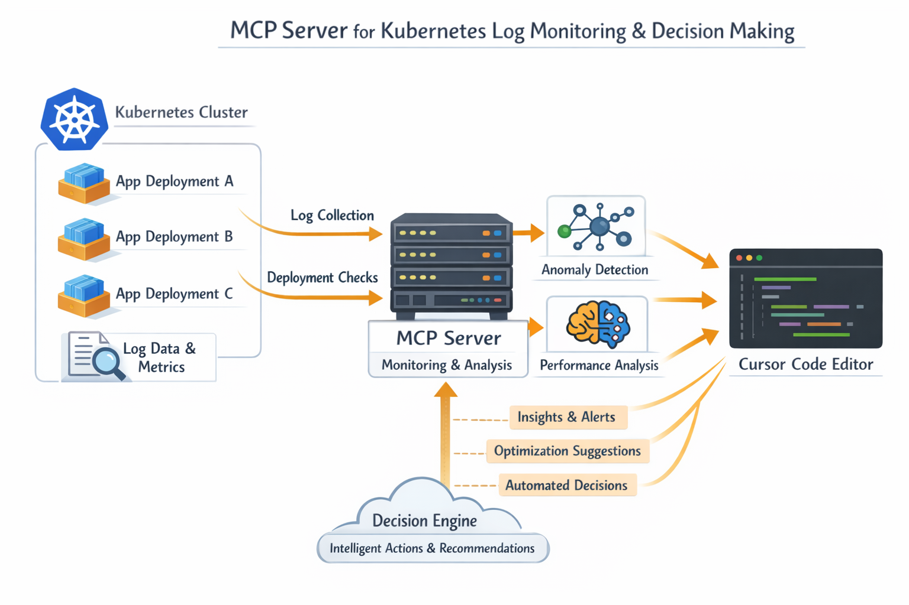

# Kubernetes Contextualist

A Model Context Protocol (MCP) server that provides AI assistants with direct access to Kubernetes cluster information through custom tools. This server enables seamless interaction with Kubernetes resources, allowing you to query pods, fetch logs, and monitor cluster health directly from your AI assistant.

## 🏗️ Architecture



The Kubernetes Contextualist MCP server acts as a bridge between AI assistants (like Cursor) and your Kubernetes cluster, providing secure, programmatic access to cluster resources.

## ✨ Features

- **Pod Management**: List pods across namespaces with their current status
- **Log Retrieval**: Fetch pod logs with support for:
  - Tail lines configuration
  - Multi-container pod support
  - Previous container instance logs (useful for debugging CrashLoopBackOff)
- **Async Operations**: Built with `kubernetes-asyncio` for efficient, non-blocking operations
- **Auto-Configuration**: Automatically detects and uses kubeconfig or in-cluster configuration
- **Structured Logging**: Comprehensive logging with structlog for debugging and monitoring

## 📋 Prerequisites

- Python 3.12 or higher
- `uv` package manager (recommended) or `pip`
- Access to a Kubernetes cluster (via kubeconfig or in-cluster)
- Cursor IDE or another MCP-compatible client

## 🚀 Installation

### Using uv (Recommended)

```bash
# Clone the repository
git clone <repository-url>
cd KubernetesContextualist

# Install dependencies
uv sync
```

### Using pip

```bash
pip install -e .
```

## ⚙️ Configuration

### Setting up MCP Server in Cursor

1. Create or edit `~/.cursor/mcp.json`:

```json
{
  "mcpServers": {
    "k8s": {
      "command": "sh",
      "args": [
        "-c",
        "cd /path/to/KubernetesContextualist && uv run --with mcp[cli] mcp run src/main.py"
      ]
    }
  }
}
```

2. **Important**: Replace `/path/to/KubernetesContextualist` with the actual path to this project.

3. Restart Cursor to load the MCP server configuration.

### Kubernetes Access

The server automatically handles Kubernetes authentication:

- **Local Development**: Uses `~/.kube/config` (kubeconfig)
- **In-Cluster**: Automatically detects and uses in-cluster configuration when running inside a pod

Ensure your kubeconfig is properly configured:

```bash
kubectl config view
```

**Note**: Using your admin kubeconfig grants full cluster access, which may be more than necessary for the MCP server's operations.

## 🛠️ Available Tools

### 1. `list_pods`

List all pods in a specified namespace with their current status.

**Parameters:**
- `namespace` (str, default: "default"): The namespace to list pods from

**Example:**
```
List all pods in the kube-system namespace
```

**Output:**
```
coredns-66bc5c9577-fd72d | Running
etcd-minikube | Running
kube-apiserver-minikube | Running
...
```

### 2. `get_pod_logs`

Fetch logs from a specific Kubernetes pod.

**Parameters:**
- `pod_name` (str, required): Name of the pod to fetch logs from
- `namespace` (str, default: "default"): The namespace the pod is in
- `tail_lines` (int, default: 100): Number of recent log lines to retrieve
- `container` (str, optional): Container name (required for multi-container pods)
- `previous` (bool, default: False): Get logs from previous container instance

**Example:**
```
Get the last 50 lines of logs from the kube-controller-manager-minikube pod in kube-system namespace
```

## 📁 Project Structure

```
KubernetesContextualist/
├── src/
│   ├── __init__.py
│   ├── main.py              # MCP server entry point
│   ├── service.py            # Kubernetes API client wrapper
│   ├── schemas.py            # Data schemas
│   ├── tools/
│   │   ├── __init__.py
│   │   ├── pods.py           # Pod-related tools
│   │   ├── logs.py           # Log retrieval tools
│   │   └── events.py         # Event-related tools (future)
│   └── utils/
│       └── logger.py          # Logging configuration
├── k8s/
│   ├── sa.yaml               # Service Account manifest
│   ├── cluster-role.yaml    # ClusterRole with minimal permissions
│   └── role-binding.yaml     # ClusterRoleBinding
├── pyproject.toml            # Project dependencies and metadata
├── uv.lock                   # Dependency lock file
├── k8s-mcp.png              # Architecture diagram
└── README.md                 # This file
```

## 🔧 Development

### Running the Server Locally

```bash
# Using uv
uv run --with mcp[cli] mcp run src/main.py

# Or directly with Python (after installing dependencies)
python src/main.py
```

### Testing

The server uses stdio transport for MCP communication. When running manually, you can test tool registration:

```python
import asyncio
from src.main import mcp

async def test():
    tools = await mcp.list_tools()
    print(f"Registered tools: {[t.name for t in tools]}")

asyncio.run(test())
```

### Logging

Logging is configured to use stderr (to avoid corrupting JSON-RPC messages on stdout). Logs are structured using structlog and can be viewed in:

- **Development**: Pretty-printed console output
- **Production**: JSON-formatted logs

## 🔒 Security Considerations

### Least Privilege Principle

This project follows the principle of least privilege by providing RBAC resources that grant only the minimum permissions required:

- **Read-only access** to pod information (`get`, `list`, `watch` on `pods`)
- **Read-only access** to pod logs (`get` on `pods/log`)
- **No write permissions** - cannot create, update, or delete resources
- **No access** to other resources like nodes, secrets, configmaps, etc.

**What it does NOT grant:**
- ❌ Write access to any resources
- ❌ Access to secrets, configmaps, or other resources
- ❌ Access to nodes or cluster-level resources
- ❌ Ability to exec into pods or create resources

## 📝 Dependencies

- `kubernetes-asyncio>=34.3.3`: Async Kubernetes client library
- `mcp[cli]>=1.25.0`: Model Context Protocol SDK
- `pydantic>=2.12.5`: Data validation
- `structlog>=24.1.0`: Structured logging

## 🤝 Contributing

Contributions are welcome! Please feel free to submit a Pull Request.

## 🙏 Acknowledgments

- Built with [FastMCP](https://gofastmcp.com/)
- Uses [kubernetes-asyncio](https://github.com/tomplus/kubernetes_asyncio) for Kubernetes API access
